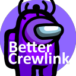

[![Donate][paypal-shield]](paypal-url)

<br />
<p align="center">
  <a href="https://github.com/OhMyGuus/BetterCrewlink-mobile">
    
  </a>
  <h3 align="center">BetterCrewLink Mobile is here!</h3>


  <p align="center">
    Free, open, Among Us proximity voice chat.
    <br />
    <a href="https://github.com/OhMyGuus/BetterCrewlink-mobile/issues">Report Bug</a>
    ·
    <a href="https://github.com/OhMyGuus/BetterCrewlink-mobile/issues">Request Feature</a>
    ·
    <a href="#installation">Installation Instructions</a>
  </p>
  <p align="center">
    <b><a href="https://www.paypal.com/donate?hosted_button_id=KS43BDTGN76JQ">Donate to BetterCrewLink</a></b></br>
  (all donations will be used for the apple developer license and extra servers)</br>
   <b><a href="https://paypal.me/ottomated">Donate to ottomated (offical crewlink)</a></b>
  </p>
</p>
<hr />

<p>
  
<b>Notes:</b><br />

- This is an unofficial fork of CrewLink, for any problem, issue or suggestion you have with BetterCrewLink talk to us on our [Discord](https://discord.gg/qDqTzvj4SH) or [GitHub](https://github.com/OhMyGuus/BetterCrewlink-mobile/issues), do not report any problems to the official Discord or GitHub project of CrewLink as they will not support you.

- For issues with this fork you can message me on Discord (ThaGuus#2140) or reporting in [GitHub](https://github.com/OhMyGuus/BetterCrewlink-mobile/issues) and I will do my best to resolve it.

- To get the most of BetterCrewLink use the voice server: <a href="https://bettercrewl.ink">`https://bettercrewl.ink`</a>

</p>
<a href="https://discord.gg/qDqTzvj4SH">  </a>

<!-- TABLE OF CONTENTS -->
## Table of Contents

* [About the Project](#about-the-project)
* [Installation](#installation)
  * [Setup Instructions](#setup-instructions)
* [Development](#development)
  * [Prerequisites](#prerequisites)
  * [Setup](#setup)
* [Contributing](#contributing)
* [License](#license)

<!-- ABOUT THE PROJECT -->
## About The Project

This project implements proximity voice chat for mobile users in Among Us. As long as there is a PC user with "Mobile Host" enabled in your lobby, you will be able to hear people near you.

## Installation

Download the latest version from [releases](https://github.com/OhMyGuus/BetterCrewlink-mobile/releases/latest) and run the `Bettercrewlink-v-X-X-X-a.apk` file on your phone. You may have to allow chrome to install apps on your phone.

You can also use the web version in your browser [here](https://web.bettercrewl.ink/).

If you have a PC and want to download the PC version of BetterCrewLink (without being the Bluestacks) [click here](https://github.com/OhMyGuus/BetterCrewLink/releases/latest).

### Setup Instructions

* Open the app.
* Ensure there is one person in the lobby with "Mobile Host" enabled on their PC (they must use [BetterCrewLink](https://github.com/OhMyGuus/BetterCrewLink)).
* Fill in the required information (make sure you have a unique name in your lobby).
* Hit the connect button.
  * If you are waiting on the connecting screen for a while you may want to check that all the information is correct and the is a pc user with "Mobile Host" enabled in the lobby.
* All done!

## Development

You only need to follow the below instructions if you are trying to modify this software. Otherwise, please download the latest version from the [github releases](https://github.com/OhMyGuus/BetterCrewlink-mobile/releases).

Server code is located at [OhMyGuus/BetterCrewLink-server](https://github.com/OhMyGuus/BetterCrewLink-server). Please use a local server for development purposes.

### Prerequisites

This is an example of how to list things you need to use the software and how to install them.
* [node.js](https://nodejs.org/en/download/)
* Ionic cli
```sh
npm install -g @ionic/cli
```

### Setup

1. Clone the repo
```sh
git clone https://github.com/OhMyGuus/BetterCrewlink-mobile.git
cd BetterCrewlink-mobile
```
2. Install packages and sync
```sh
npm install 
ionic capacitor sync
```
3. Run the project
```JS
ionic serve
```

<!-- CONTRIBUTING -->
## Contributing

Any contributions you make are greatly appreciated.

1. [Fork the Project](https://github.com/OhMyGuus/BetterCrewlink-mobile/fork)
2. Create your Feature Branch (`git checkout -b feature/AmazingFeature`)
3. Commit your Changes (`git commit -m 'Add some AmazingFeature'`)
4. Push to the Branch (`git push origin feature/AmazingFeature`)
5. Open a Pull Request

## License

Distributed under the GNU General Public License v3.0. See <a href="https://github.com/MatadorProBr/BetterCrewLink-Mobile/blob/master/LICENSE">`LICENSE`</a> for more information.

[paypal-url]: https://www.paypal.com/donate?hosted_button_id=KS43BDTGN76JQ
[paypal-shield]: https://img.shields.io/badge/Donate-PayPal-green.svg
